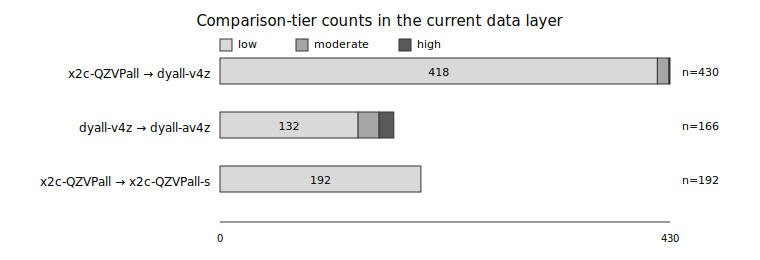
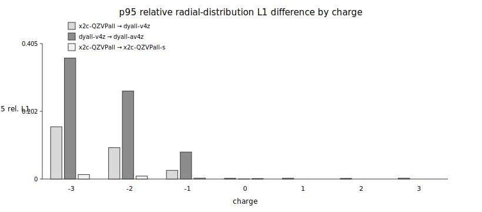

# Results

## Dataset inventory

The current data layer contains four generated profile/radii/QA datasets. The two primary datasets cover all curated states within their element ranges. The supplemented/augmented branches contain neutral and anion states only; cations are not repeated because compact positive ions are not the main target of basis-tail sensitivity analysis.

<!-- BEGIN AUTO:table:dataset_inventory -->
| dataset ID | basis | branch role | state scope | profile rows | QA rows |
|---|---|---|---|---|---|
| `pbe0_sfx2c_x2cqzvpall_h-rn_spherical_v2` | `x2c-QZVPall` | primary H--Rn | H-Rn all curated states | 430 | 430 |
| `pbe0_sfx2c_dyallv4z_h-lr_spherical_v2` | `dyall-v4z` | primary H--Lr | H-Lr all curated states | 501 | 501 |
| `pbe0_sfx2c_x2cqzvpalls_h-rn_spherical_v2` | `x2c-QZVPall-s` | supplemented H--Rn | H-Rn neutral and anion states with x2c-QZVPall-s; cations excluded | 192 | 192 |
| `pbe0_sfx2c_dyallav4z_h-ba_hf-ra_spherical_v2` | `dyall-av4z` | augmented available intervals | H-Ba and Hf-Ra neutral atoms plus selected anions in the same intervals with dyall-av4z; cations excluded | 166 | 166 |
<!-- END AUTO:table:dataset_inventory -->

Together, these datasets contain 1289 generated dataset-state rows. A dataset-state row means one state emitted in one basis branch; the same curated state can appear in more than one branch when it participates in a basis comparison.

## State and charge coverage

The curated table contains 501 state records. The charge distribution shows the intended scope: neutral atoms, cations through the current charge policy, accepted/provisional monoanions, source-backed diagnostic monoanions, and formal anions.

<!-- BEGIN AUTO:table:state_counts_by_charge -->
| charge | curated states |
|---|---|
| -3 | 6 |
| -2 | 20 |
| -1 | 86 |
| 0 | 103 |
| +1 | 102 |
| +2 | 95 |
| +3 | 89 |
<!-- END AUTO:table:state_counts_by_charge -->

The state-role table separates source-backed references from explicitly formal rows. This distinction is essential for interpretation: formal anion rows are useful reference gauges, not claims of isolated stable anions.

<!-- BEGIN AUTO:table:state_counts_by_role -->
| state role | curated states |
|---|---|
| reference | 229 |
| reference_uncertain | 160 |
| bound_experimental | 65 |
| bound_provisional | 4 |
| diagnostic_theory | 3 |
| formal_monoanion | 14 |
| formal_multianion | 26 |
<!-- END AUTO:table:state_counts_by_role -->

Because the profile branches overlap, the generated-row counts are larger than the curated-state counts. The generated-row distribution below is the effective coverage that downstream consumers see when they read all profile/radii/QA datasets.

<!-- BEGIN AUTO:table:generated_rows_by_charge -->
| charge | generated dataset-state rows |
|---|---|
| -3 | 24 |
| -2 | 80 |
| -1 | 313 |
| 0 | 348 |
| +1 | 187 |
| +2 | 174 |
| +3 | 163 |
<!-- END AUTO:table:generated_rows_by_charge -->

<!-- BEGIN AUTO:table:generated_rows_by_role -->
| state role | generated dataset-state rows |
|---|---|
| reference | 594 |
| reference_uncertain | 278 |
| bound_experimental | 247 |
| bound_provisional | 11 |
| diagnostic_theory | 4 |
| formal_monoanion | 51 |
| formal_multianion | 104 |
<!-- END AUTO:table:generated_rows_by_role -->

The generated layer therefore exposes the formal anion rows explicitly rather than hiding them in a generic anion class. This is useful for sensitivity analysis because the formal rows are exactly where low-density tail behavior is expected to be most delicate.

## Validation outcomes

The validation summary below reports one row per generated dataset. `max |ΔN|` is the maximum independent electron-count error in electrons. The angular quantity is the maximum relative angular standard-deviation diagnostic above the QA density floor. Linear-dependency warnings count rows where the backend reported basis linear-dependency handling or dropped primitive behavior.

<!-- BEGIN AUTO:table:qa_validation_summary -->
| dataset ID | basis | rows | failed rows | max \|ΔN\| | max angular σ/ρ | linear-dependency warnings |
|---|---|---|---|---|---|---|
| `pbe0_sfx2c_x2cqzvpall_h-rn_spherical_v2` | `x2c-QZVPall` | 430 | 0 | 2.30e-12 | 1.56e-14 | 0 |
| `pbe0_sfx2c_dyallv4z_h-lr_spherical_v2` | `dyall-v4z` | 501 | 0 | 2.43e-12 | 3.75e-15 | 266 |
| `pbe0_sfx2c_x2cqzvpalls_h-rn_spherical_v2` | `x2c-QZVPall-s` | 192 | 0 | 2.33e-12 | 3.83e-15 | 38 |
| `pbe0_sfx2c_dyallav4z_h-ba_hf-ra_spherical_v2` | `dyall-av4z` | 166 | 0 | 2.30e-12 | 2.68e-15 | 68 |
<!-- END AUTO:table:qa_validation_summary -->

All generated rows pass the current validation criteria. The electron-count and angular-sphericity errors are near numerical precision. Linear-dependency warnings are most common in the large Dyall branches and in the supporting comparison branches, but they do not coincide with validation failures in the committed data layer.

<!-- BEGIN AUTO:table:linear_dependency_summary -->
| basis | QA rows | LD-warning rows | fraction |
|---|---|---|---|
| `x2c-QZVPall` | 430 | 0 | 0% |
| `dyall-v4z` | 501 | 266 | 53.1% |
| `x2c-QZVPall-s` | 192 | 38 | 19.8% |
| `dyall-av4z` | 166 | 68 | 41.0% |
| **all datasets** | 1289 | 372 |  |
<!-- END AUTO:table:linear_dependency_summary -->

The validation result supports using the committed profile/radii/QA layer as the baseline for downstream export and interoperability work. It does not mean that every formal anion is physically stable; it means the generated density row is internally consistent under the declared reference convention.

## Primary basis-family comparison

The primary comparison matches `x2c-QZVPall` and `dyall-v4z` over the H--Rn overlap by exact `state_id` and state-record digest. The comparison tests how two primary all-electron scalar-relativistic basis families change the same spherical reference state. It is not a diffuse-basis test.

<!-- BEGIN AUTO:table:primary_basis_comparison_summary -->
| comparison | matched states | integrity/validation failures | low | moderate | high | outliers | max relative L1 | max sup \|ΔN(r)\| / e | max \|ΔR_cut\| / Å |
|---|---|---|---|---|---|---|---|---|---|
| `x2c-QZVPall` → `dyall-v4z` | 430 | 0 | 418 | 11 | 1 | 1 | 0.163 | 0.811 | 1.040 |
<!-- END AUTO:table:primary_basis_comparison_summary -->

Most matched states are in the low-difference tier. The single high-difference row is a formal multianion, `C_qm3_mult2_formal`. The table below groups the same comparison by charge. The relative L1 columns summarize redistribution in the radial distribution \(D(r)=4\pi r^2\rho(r)\), while `sup |ΔN(r)|` summarizes the largest cumulative electron-count separation at any radius.

<!-- BEGIN AUTO:table:primary_basis_comparison_by_charge -->
| comparison | charge | n | low | moderate | high | median rel. L1 | p95 rel. L1 | max rel. L1 | max sup \|ΔN(r)\| / e | max \|ΔR_cut\| / Å |
|---|---|---|---|---|---|---|---|---|---|---|
| `x2c-QZVPall` → `dyall-v4z` | -3 | 6 | 1 | 4 | 1 | 0.0567 | 0.1561 | 0.1631 | 0.8106 | 0.6431 |
| `x2c-QZVPall` → `dyall-v4z` | -2 | 20 | 15 | 5 | 0 | 0.0209 | 0.0938 | 0.0946 | 0.5924 | 0.7169 |
| `x2c-QZVPall` → `dyall-v4z` | -1 | 80 | 78 | 2 | 0 | 0.0063 | 0.0258 | 0.1165 | 0.4680 | 1.0401 |
| `x2c-QZVPall` → `dyall-v4z` | 0 | 86 | 86 | 0 | 0 | 0.0011 | 0.0022 | 0.0046 | 0.0136 | 0.0309 |
| `x2c-QZVPall` → `dyall-v4z` | +1 | 85 | 85 | 0 | 0 | 0.0009 | 0.0022 | 0.0040 | 0.0136 | 0.0363 |
| `x2c-QZVPall` → `dyall-v4z` | +2 | 79 | 79 | 0 | 0 | 0.0008 | 0.0017 | 0.0021 | 0.0136 | 0.0218 |
| `x2c-QZVPall` → `dyall-v4z` | +3 | 74 | 74 | 0 | 0 | 0.0009 | 0.0024 | 0.0040 | 0.0243 | 0.0234 |
<!-- END AUTO:table:primary_basis_comparison_by_charge -->

The distribution table gives all-state quantiles for the main scalar diagnostics. Median primary-basis differences are small. The upper tail is driven by anionic and especially formal anionic references, where radial tails and weak binding are expected to be more basis-sensitive than compact neutral or cationic states.

<!-- BEGIN AUTO:table:primary_basis_metric_distributions -->
| metric | n | p50 | p90 | p95 | p99 | max |
|---|---|---|---|---|---|---|
| relative L1 | 430 | 0.0011 | 0.0098 | 0.0185 | 0.0944 | 0.1631 |
| sup \|ΔN(r)\| / e | 430 | 0.0078 | 0.1978 | 0.2968 | 0.5974 | 0.8106 |
| mean \|radial shift\| / Å | 430 | 0.0001 | 0.0131 | 0.0215 | 0.0837 | 0.1511 |
| max \|ΔR_cut\| / Å | 430 | 0.0079 | 0.1655 | 0.3644 | 0.6766 | 1.0401 |
| \|Δ tail N(r>5 bohr)\| / e | 430 | 0.0006 | 0.0562 | 0.1691 | 0.4526 | 0.8069 |
| \|Δ tail N(r>10 bohr)\| / e | 430 | 5.9065e-06 | 0.0275 | 0.1421 | 0.2971 | 0.3697 |
| \|Δ tail N(r>15 bohr)\| / e | 430 | 9.8850e-09 | 0.0002 | 0.0063 | 0.0726 | 0.1061 |
| \|Δ tail N(r>20 bohr)\| / e | 430 | 8.0311e-12 | 3.5948e-07 | 0.0000 | 0.0033 | 0.0104 |
<!-- END AUTO:table:primary_basis_metric_distributions -->

<!-- BEGIN AUTO:figure:comparison_tier_counts -->

<!-- END AUTO:figure:comparison_tier_counts -->

The outlier row is shown explicitly so that downstream users can decide whether it matters for their application. It should be treated as a scientific sensitivity flag for a formal reference state rather than as evidence of corrupted generated data.

<!-- BEGIN AUTO:table:primary_basis_outliers -->
| state ID | element | charge | state role | tier | rel. L1 | sup \|ΔN(r)\| / e | max \|ΔR_cut\| / Å | flags |
|---|---|---|---|---|---|---|---|---|
| `C_qm3_mult2_formal` | C | -3 | formal_multianion | high | 0.1631 | 0.7189 | 0.4980 | relative_l1_outlier;cumulative_delta_watch;mean_radial_shift_watch |
<!-- END AUTO:table:primary_basis_outliers -->

## Supplemented/augmented basis sensitivity

The supplemented/augmented comparison uses the same matched-state contract but compares a primary branch with its supporting branch. The current neutral-plus-anion supporting branches are unified by basis identity rather than split into separate neutral and anion datasets. The two comparisons are not equivalent: `dyall-av4z` is an augmented Dyall branch, whereas `x2c-QZVPall-s` is an NMR-shielding-oriented supplemented x2c branch rather than a standard diffuse tail basis.

<!-- BEGIN AUTO:table:basis_sensitivity_summary -->
| comparison | matched states | integrity/validation failures | low | moderate | high | outliers | max relative L1 | max sup \|ΔN(r)\| / e | max \|ΔR_cut\| / Å |
|---|---|---|---|---|---|---|---|---|---|
| `dyall-v4z` → `dyall-av4z` | 166 | 0 | 132 | 20 | 14 | 14 | 0.383 | 1.661 | 2.127 |
| `x2c-QZVPall` → `x2c-QZVPall-s` | 192 | 0 | 192 | 0 | 0 | 0 | 0.014 | 0.033 | 0.020 |
<!-- END AUTO:table:basis_sensitivity_summary -->

The x2c supplemented branch is uniformly low-sensitivity in the current data, which is consistent with treating it as a branch that most density-reference users can ignore. The Dyall augmented branch has 14 high-sensitivity rows, all in formal anion references. This pattern is visible when the data are grouped by charge.

<!-- BEGIN AUTO:table:basis_sensitivity_by_charge -->
| comparison | charge | n | low | moderate | high | median rel. L1 | p95 rel. L1 | max rel. L1 | max sup \|ΔN(r)\| / e | max \|ΔR_cut\| / Å |
|---|---|---|---|---|---|---|---|---|---|---|
| `dyall-v4z` → `dyall-av4z` | -3 | 6 | 0 | 0 | 6 | 0.1186 | 0.3615 | 0.3834 | 1.6607 | 1.8616 |
| `dyall-v4z` → `dyall-av4z` | -2 | 20 | 3 | 10 | 7 | 0.0528 | 0.2630 | 0.2935 | 1.1532 | 1.6452 |
| `dyall-v4z` → `dyall-av4z` | -1 | 67 | 56 | 10 | 1 | 0.0048 | 0.0805 | 0.2175 | 0.7016 | 2.1275 |
| `dyall-v4z` → `dyall-av4z` | 0 | 73 | 73 | 0 | 0 | 0.0000 | 0.0002 | 0.0004 | 0.0022 | 0.0071 |
| `x2c-QZVPall` → `x2c-QZVPall-s` | -3 | 6 | 6 | 0 | 0 | 0.0018 | 0.0134 | 0.0138 | 0.0326 | 0.0135 |
| `x2c-QZVPall` → `x2c-QZVPall-s` | -2 | 20 | 20 | 0 | 0 | 0.0004 | 0.0088 | 0.0095 | 0.0185 | 0.0197 |
| `x2c-QZVPall` → `x2c-QZVPall-s` | -1 | 80 | 80 | 0 | 0 | 0.0005 | 0.0027 | 0.0042 | 0.0107 | 0.0134 |
| `x2c-QZVPall` → `x2c-QZVPall-s` | 0 | 86 | 86 | 0 | 0 | 0.0005 | 0.0015 | 0.0018 | 0.0107 | 0.0059 |
<!-- END AUTO:table:basis_sensitivity_by_charge -->

The state-role grouping makes the interpretation clearer: high sensitivity is concentrated in formal monoanion/multianion rows rather than neutral references or source-backed experimental monoanions.

<!-- BEGIN AUTO:table:basis_sensitivity_by_role -->
| comparison | state role | n | low | moderate | high | median rel. L1 | max rel. L1 |
|---|---|---|---|---|---|---|---|
| `dyall-v4z` → `dyall-av4z` | reference | 73 | 73 | 0 | 0 | 0.0000 | 0.0004 |
| `dyall-v4z` → `dyall-av4z` | bound_experimental | 56 | 52 | 4 | 0 | 0.0036 | 0.1030 |
| `dyall-v4z` → `dyall-av4z` | bound_provisional | 1 | 0 | 1 | 0 | 0.0138 | 0.0138 |
| `dyall-v4z` → `dyall-av4z` | diagnostic_theory | 1 | 1 | 0 | 0 | 0.0005 | 0.0005 |
| `dyall-v4z` → `dyall-av4z` | formal_monoanion | 9 | 3 | 5 | 1 | 0.0290 | 0.2175 |
| `dyall-v4z` → `dyall-av4z` | formal_multianion | 26 | 3 | 10 | 13 | 0.0549 | 0.3834 |
| `x2c-QZVPall` → `x2c-QZVPall-s` | reference | 86 | 86 | 0 | 0 | 0.0005 | 0.0018 |
| `x2c-QZVPall` → `x2c-QZVPall-s` | bound_experimental | 63 | 63 | 0 | 0 | 0.0005 | 0.0042 |
| `x2c-QZVPall` → `x2c-QZVPall-s` | bound_provisional | 3 | 3 | 0 | 0 | 0.0005 | 0.0005 |
| `x2c-QZVPall` → `x2c-QZVPall-s` | formal_monoanion | 14 | 14 | 0 | 0 | 0.0007 | 0.0039 |
| `x2c-QZVPall` → `x2c-QZVPall-s` | formal_multianion | 26 | 26 | 0 | 0 | 0.0004 | 0.0138 |
<!-- END AUTO:table:basis_sensitivity_by_role -->

<!-- BEGIN AUTO:figure:relative_l1_by_charge -->

<!-- END AUTO:figure:relative_l1_by_charge -->

The high-sensitivity Dyall augmented rows are listed below. They are mainly light and p-block formal anions, with the strongest relative L1 response for `C_qm3_mult2_formal`. The large cutoff-radius shifts show that the augmented basis changes low-density tails and cumulative radial redistribution, not the integer electron count.

<!-- BEGIN AUTO:table:basis_sensitivity_outliers -->
| state ID | element | charge | state role | tier | rel. L1 | sup \|ΔN(r)\| / e | max \|ΔR_cut\| / Å | flags |
|---|---|---|---|---|---|---|---|---|
| `Be_qm1_mult2_formal` | Be | -1 | formal_monoanion | high | 0.2175 | 0.5384 | 1.1900 | relative_l1_outlier;cumulative_delta_watch;mean_radial_shift_outlier |
| `B_qm2_mult4_formal` | B | -2 | formal_multianion | high | 0.2935 | 1.0184 | 1.6333 | relative_l1_outlier;cumulative_delta_outlier;mean_radial_shift_outlier |
| `C_qm3_mult2_formal` | C | -3 | formal_multianion | high | 0.3834 | 1.6607 | 1.8616 | relative_l1_outlier;cumulative_delta_outlier;mean_radial_shift_outlier |
| `C_qm2_mult3_formal` | C | -2 | formal_multianion | high | 0.2251 | 0.8674 | 1.5880 | relative_l1_outlier;cumulative_delta_watch;mean_radial_shift_watch |
| `N_qm3_mult1_formal` | N | -3 | formal_multianion | high | 0.2957 | 1.4680 | 1.6062 | relative_l1_outlier;cumulative_delta_outlier;mean_radial_shift_outlier |
| `N_qm2_mult2_formal` | N | -2 | formal_multianion | high | 0.2614 | 1.1532 | 1.6452 | relative_l1_outlier;cumulative_delta_outlier;mean_radial_shift_outlier |
| `Al_qm2_mult4_formal` | Al | -2 | formal_multianion | high | 0.1386 | 1.0191 | 1.2948 | relative_l1_watch;cumulative_delta_outlier;mean_radial_shift_watch |
| `P_qm3_mult1_formal` | P | -3 | formal_multianion | high | 0.1587 | 1.4073 | 1.6637 | relative_l1_outlier;cumulative_delta_outlier;mean_radial_shift_watch |
| `Ga_qm2_mult4_formal` | Ga | -2 | formal_multianion | high | 0.0667 | 1.0836 | 1.1706 | relative_l1_watch;cumulative_delta_outlier;mean_radial_shift_watch |
| `As_qm3_mult1_formal` | As | -3 | formal_multianion | high | 0.0786 | 1.3931 | 1.6705 | relative_l1_watch;cumulative_delta_outlier;mean_radial_shift_watch |
| `In_qm2_mult4_formal` | In | -2 | formal_multianion | high | 0.0418 | 1.0468 | 0.9184 | cumulative_delta_outlier |
| `Sb_qm3_mult1_formal` | Sb | -3 | formal_multianion | high | 0.0510 | 1.3528 | 1.6587 | relative_l1_watch;cumulative_delta_outlier |
| `Tl_qm2_mult4_formal` | Tl | -2 | formal_multianion | high | 0.0276 | 1.1325 | 1.1864 | cumulative_delta_outlier |
| `Bi_qm3_mult1_formal` | Bi | -3 | formal_multianion | high | 0.0328 | 1.3868 | 1.7081 | cumulative_delta_outlier |
<!-- END AUTO:table:basis_sensitivity_outliers -->

## Practical result

The current data layer supports a clear default policy. Use the primary branches for reproducible default analyses: `x2c-QZVPall` for H--Rn when that element range is sufficient, and `dyall-v4z` for the broader H--Lr branch. Most users can ignore `x2c-QZVPall-s`; it is retained as an auditable supplemented comparison branch, not as the recommended tail-convergence reference. When low-density tails are central to the scientific question, prefer the Dyall primary/augmented comparison where its element coverage exists, and report formal-anion sensitivity explicitly.

The supplemented/augmented branches should not be silently substituted into the primary dataset. They are separate reference gauges. Their value is precisely that they make basis-tail sensitivity observable and auditable.
